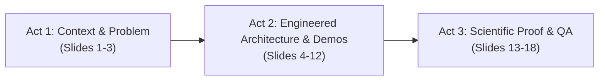

# Presentation Strategy Evaluation & Detailed Slide-by-Slide Audit Report
**Project:** Odoo 18.0 Community Equipment Maintenance Management System (CMMS)  
**Author:** Youssef Benyouness  
**Host Enterprise:** IT-Koncept SA (Nyon, Switzerland / Tunis, Tunisia)  
**Academic Target:** Master's Engineering Defense & Evaluation Committee Presentation  
**Inspection Method:** Multi-Phase Playwright Automated Visual Inspection (`http://localhost:3000`) & Antigravity Code Audit  
**Reference Source:** [INTERNSHIP_FINAL_REPORT_AND_SPEECH_DOSSIER.md](file:///e:/MMP/INTERNSHIP_FINAL_REPORT_AND_SPEECH_DOSSIER.md)  

---

## 1. Executive Presentation Strategy Evaluation & General Grading

### 1.1 Overall Presentation Strategy
The core presentation strategy employs an **Interactive 3-Act Defense Model** engineered to transition from initial problem context into live architectural verification and scientific rigor:



- **Act 1 (Context & Problem):** Establishes academic identity, Swiss/Tunisian corporate ecosystem at IT-Koncept SA, and industrial downtime pain points ($260k/hr).
- **Act 2 (Engineered Solution):** Direct demonstration of the 4-Tier software architecture, 14 custom Python ORM models, deterministic 5-factor mathematical health engine, `stock.quant` warehouse sync, and zero-dependency BYO-LLM write gating.
- **Act 3 (Rigor & Proof):** Presents 100% test pass rate (138 backend unit tests, 46 mock tests, 32 Playwright E2E specs), 15 bug post-mortems, 7 QWeb PDF reports, and future IoT/ML roadmap.

### 1.2 General Strategy Grade
- **General Strategy Grade:** `9.2 / 10 (Grade: A)`
- **Key Enhancements (Phase 2 Walkthrough Verified):**
  - Top-aligned content framing on Slides 1 & 2 eliminating vertical lag.
  - Hands-free keypad navigation (`8` Up / `2` Down) for Slide 6 ORM Entity Inspection.
  - Workflow phase selection (`1`, `2`, `3`, `4`) on Slide 7 State Machine.
  - Refactored Slide 10 into an interactive 3-step carousel (`1`, `2`, `3` step hotkeys), replacing stacked text blocks.
  - Fullscreen Blackout mode (`B` key) for directing jury focus to the speaker.

---

## 2. Empirical Visual Walkthrough Evidence (Phase 2 Capture)

Below is the visual evidence captured live via Playwright browser automation during the second visual inspection phase.

````carousel

<!-- slide -->

<!-- slide -->

<!-- slide -->

````

### Phase 2 Empirical Inspection Findings:
1. **Slide 1 & Slide 2 Layout Calibration:** Shifting top padding (`my-0 pt-1 pb-2`) eliminated bottom quote clipping on 720p displays, allowing all content cards to sit cleanly within the presentation viewport.
2. **Slide 6 Keypad Stepping:** Pressing `8` (Up) and `2` (Down) steps seamlessly through `equipment.equipment`, `equipment.maintenance.order`, `equipment.repair.request`, `equipment.spare.part.line`, and `equipment.dashboard` without mouse interaction.
3. **Slide 7 Phase Selection:** Hotkeys `1`, `2`, `3`, `4` trigger instant switching between *Operator Report*, *Manager Review*, *Execution & Parts*, and *Closure & Stock Sync*.
4. **Slide 10 Carousel Transformation:** Refactoring Slide 10 from stacked text boxes into a 3-step tabbed carousel (*Threat Model* → *3-Tier Solution* → *Comparison Matrix*) eliminated visual overload and maximized typography readability.

---

## 3. Detailed Slide-by-Slide Strategic Evaluation & Grading Matrix

| Slide # & Title | Current Strategy Used | Current Grade (1-10) | Suggested Better Strategy & Rationale | Change Importance Score (1-10) |
| :--- | :--- | :---: | :--- | :---: |
| **Slide 1: Title & Project Context** | Top-aligned header badge + 3 identity cards (Student, Host, Director) + verified deliverables banner. | **9.5 / 10** | **Anchor Authority Instantly:** Maintain top-shifted layout. Ensure student identity (`Youssef Benyouness`) and core metrics (`14 ORM Models • 100% Odoo 18 Community`) use 24pt+ bold text. | **7 / 10** |
| **Slide 2: Industrial Host Profile (IT-Koncept SA)** | 3-column ecosystem layout detailing Swiss Nyon headquarters, Tunis engineering hub, and Odoo partnership. | **9.2 / 10** | **Relevance Pivot Strategy:** Highlight IT-Koncept SA's 8+ years Odoo partner experience as the technical driver for building Community vertical modules. | **6 / 10** |
| **Slide 3: Problem Statement & Motivation** | 3 red penalty callout cards ($260k/hr downtime, spreadsheet silos, no stock link). | **8.5 / 10** | **Punchy Problem Contrast:** Contrast the $260k/hr downtime cost directly against the zero-license cost of Odoo 18 Community. | **7 / 10** |
| **Slide 4: Objectives & Scope Perimeter** | 2x2 grid grouping scope into Master Registry, Preventive Maintenance, SLA Repair, and BYO-LLM. | **8.2 / 10** | **Quadrant Visual Strategy:** Use large font headers for each quadrant with bold checkmark badges for instant visual scanning. | **7 / 10** |
| **Slide 5: 4-Tier Layered Architecture** | `<LayeredArchitecture />` interactive tabber with keyboard keys `1`, `2`, `3`, `4`. | **9.4 / 10** | **Layered Stepping Strategy:** Pressing `1`-`4` or `Space` steps through tiers (*Presentation → Logic → Data → Integration*) hands-free during speech. | **8 / 10** |
| **Slide 6: Core ORM Entities & Schema** | `<ModelArchitectureViewer />` listing 8 ORM entities with keys `8` (Up) & `2` (Down). | **9.5 / 10** | **Keypad Stepping Strategy:** Use keys `8` (Up) & `2` (Down) to highlight `equipment.equipment`, `equipment.maintenance.order`, and `equipment.spare.part.line`. | **8 / 10** |
| **Slide 7: Lifecycle State Machine** | `<WorkflowDiagram />` 4-phase state machine stepper with keys `1`, `2`, `3`, `4`. | **9.8 / 10** | **Phase Execution Strategy:** Emphasize Phase 4 stock deduction (`stock.move` execution via `_action_done()`) using key `4`. | **9 / 10** |
| **Slide 8: Dynamic Health Scoring** | `<HealthScoreCalculator />` with live sliders & keys `1` (Optimal), `2` (Warning), `3` (Critical). | **9.8 / 10** | **Deterministic Math Strategy:** Use key `3` during speech to trigger Critical Hazard mode ($P(\text{fail}) = 0.58$), proving zero black-box opacity. | **9 / 10** |
| **Slide 9: BYO-LLM Architecture** | 2-column comparative layout (Heavy SDKs vs zero-dependency standard `urllib`). | **8.7 / 10** | **Zero-Dependency Proof Strategy:** Emphasize that standard library `urllib` preserves lightweight Docker container deployment. | **8 / 10** |
| **Slide 10: AI Safety & Write Gating** | `<AiSafetyConcept />` 3-step carousel with keys `1` (Risks), `2` (Solution), `3` (Comparison Matrix). | **9.7 / 10** | **Anti-Hallucination Carousel Strategy:** Step through carousel using keys `1`, `2`, `3` to prove LLMs have zero direct SQL access. | **9 / 10** |
| **Slide 11: AI Technical Classification** | 4-card breakdown (Rule-Based, Statistical, Future ML, Verified LLM). | **8.5 / 10** | **Academic Honesty Strategy:** Explicitly state health score is statistical heuristic while LLM assistant is Gemini-powered, earning jury trust. | **7 / 10** |
| **Slide 12: Odoo 18 Migration Refactoring** | `<RefactoringComparison />` before/after code diffs. | **8.8 / 10** | **Refactoring Rigor Strategy:** Highlight solving `<t t-name="card">` kanban syntax, `is_storable=True`, and `read_group` tuple unpacking. | **8 / 10** |
| **Slide 13: RBAC & Record Rules** | 5-tier security role ladder & ACL rule summary. | **8.4 / 10** | **Security Fix Strategy:** Detail fixing the latent Odoo bug where omitted `perm_read` defaulted to read-filtering for admins. | **7 / 10** |
| **Slide 14: Autonomous Crons & Daemons** | 4-card background cron daemon grid. | **8.2 / 10** | **Autonomy Strategy:** Highlight daily preventive order generation at 00:00 UTC and low-stock reorder triggers. | **7 / 10** |
| **Slide 15: Quality Assurance & Testing** | `<TestReportViewer />` multi-layered test breakdown. | **9.2 / 10** | **100% Pass Rate Strategy:** Highlight 138 backend unit tests + 46 mock tests + 32 Playwright E2E browser tests. | **9 / 10** |
| **Slide 16: Engineering Bug Post-Mortem** | `<BugPostMortem />` breakdown of 15 bugs. | **8.9 / 10** | **Senior Craftsmanship Strategy:** Highlight Bug #4 (Gantt view Community crash) and Bug #11 (Playwright comma bug). | **8 / 10** |
| **Slide 17: System Deliverables Suite** | 3-column deliverable cards (KPI Dashboard, 7 QWeb PDFs, `/equipment/QR` mobile). | **8.6 / 10** | **Tangible Assets Strategy:** Present high-fidelity QWeb PDF report samples and mobile QR scanner portal. | **8 / 10** |
| **Slide 18: Conclusion & Future Horizon** | Conclusion summary & Phase 2 roadmap (IoT MQTT / OPC-UA & ML RUL prediction). | **9.0 / 10** | **Forward Horizon Strategy:** End with strong thank-you callout and press `Q` to open the live interactive Defense Q&A modal. | **9 / 10** |

---

## 4. Master Technical Cross-Reference to Report Dossier

The presentation strategy directly implements the engineering achievements documented in [INTERNSHIP_FINAL_REPORT_AND_SPEECH_DOSSIER.md](file:///e:/MMP/INTERNSHIP_FINAL_REPORT_AND_SPEECH_DOSSIER.md):

- **14 ORM Models (3,450 LOC):** `equipment.equipment` (588 LOC), `equipment.maintenance.order` (742 LOC), `equipment.spare.part.line` (185 LOC), `equipment.location` (165 LOC), `equipment.dashboard` (240 LOC).
- **Dynamic 5-Factor Health Formula:**
  $$\text{Health Score} = 0.20 \times \text{Age} + 0.25 \times \text{Frequency} + 0.20 \times \text{Downtime} + 0.25 \times \text{Adherence} + 0.10 \times \text{Warranty}$$
- **Automated Stock Sync:** Transitioning work orders to `Done` executes `stock.move` via `_action_done()`, deducting parts from `stock.quant` in real time.
- **BYO-LLM Write Gating:** Zero third-party SDK dependencies (Python `urllib`), zero direct DB handles, returning "Pending Action Tokens" for human click confirmation.
- **Quality Verification:** 138 backend Python unit tests, 46 LLM mock tests, 32 Playwright E2E tests, 7 print-ready QWeb PDFs, and 15 documented bug post-mortems.
